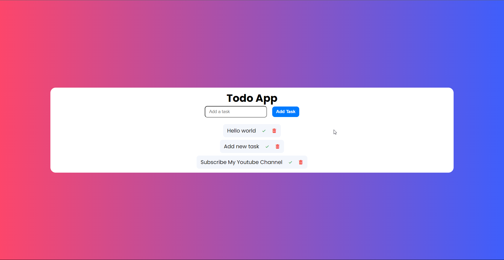

# How to create Todo app using HTML , CSS & JavaScript

## Watch Full video on Youtube 
- 

# Demo 
## live Demo :
- [demo](https://dinil-thilakarathne.github.io/50days-of-js/day%233-todo-app/index.html)

## Project Preview

## Keep with touch

- YouTube : [@sonacode]("https://www.youtube.com/@sonacode/videos")
- GitHub : [Dinil Thilakarathne]("https://github.com/Dinil-Thilakarathne/")
- Instagram : [@sona_code]("https://www.instagram.com/sona_code/")
